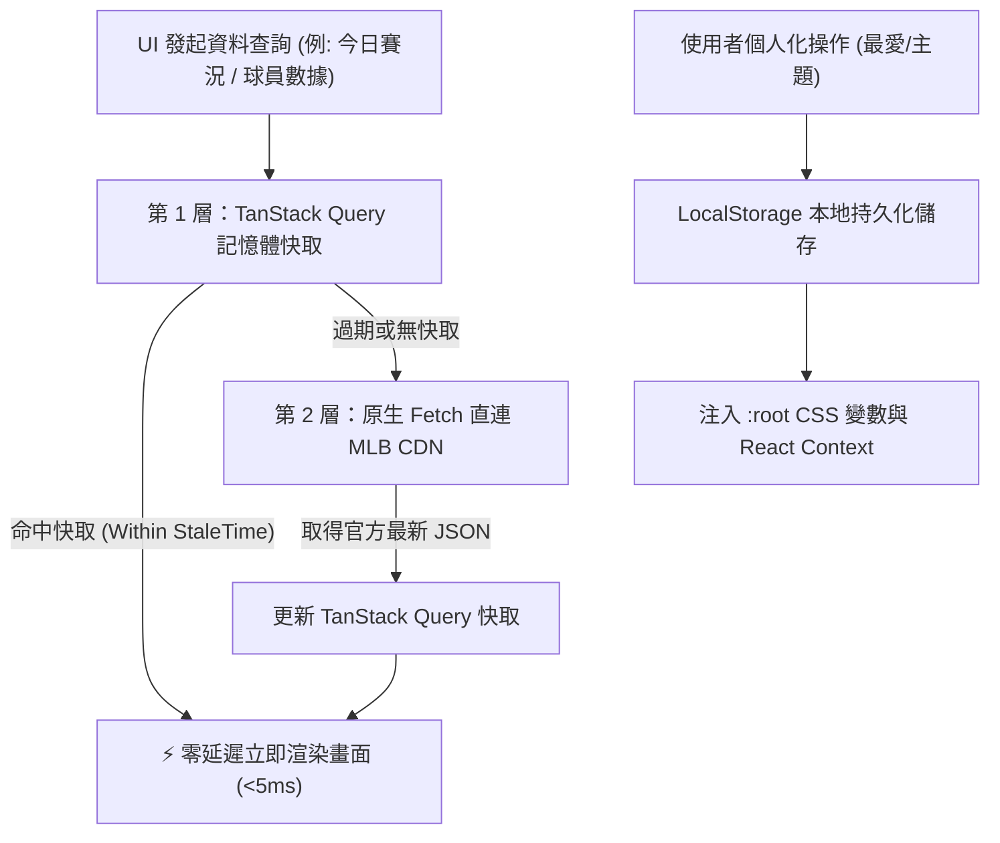

# PlateView 系統架構設計文件 (ARCHITECTURE.md)

> 本文件為 PlateView 的系統架構與設計核心說明，是系統模組劃分、資料流向與技術邊界的**現況說明（Current State）**。
> 選型決策背景與歷史理由請參閱 `docs/adr/`。

---

## 1. 系統願景與設計哲學

PlateView 是一個專為棒球迷打造的**無伺服器、零延遲、純靜態單頁應用程式（SPA）**。

### 核心原則
1. **Zero-Backend (零後端)**：完全由 GitHub Pages 託管靜態資源，瀏覽器直接與 MLB 官方 CDN 通訊。
2. **Offline-Resilient / Aggressive Caching (三級快取)**：透過本地靜態資料、React Query 記憶體快取與 LocalStorage 降低無效網路請求。
3. **Bilingual First (在地化雙語體驗)**：內建繁中譯名字典，消除台灣球迷查詢門檻。
4. **Data Isolation & TDD (高可測性)**：業務邏輯與 API 調用完全解耦，核心格式化工具 100% 單元測試覆蓋。

---

## 2. 系統架構圖 (System Architecture)

```mermaid
flowchart TD
    subgraph 靜態託管與發布層 (GitHub)
        Repo["GitHub 原始碼倉庫"] -->|"git push main"| Actions["GitHub Actions CI/CD 流水線"]
        Actions -->|"自動打包與部署"| GHPages["GitHub Pages CDN<br>(index.html, assets, JS/CSS)"]
    end

    subgraph 客戶端運行環境 (User Browser)
        Browser["使用者瀏覽器 (Desktop / Mobile)"] -->|"載入 SPA"| GHPages
        
        subgraph 前端應用架構 (React + TypeScript)
            Router["HashRouter 路由引擎<br>(#/, #/teams/:id, #/players/:id)"]
            Theming["動態主題引擎<br>(CSS Variables + 30 隊主題)"]
            Store["LocalStorage 持久化<br>(最愛球隊/球星/外觀設定)"]
            
            subgraph 頁面與 UI 模組
                Home["首頁 (比分看板 + 分區戰績)"]
                TeamView["球隊頁 (26 人著名陣容 + 戰績)"]
                PlayerView["球員頁 (賽季數據 + 近 10 場 Game Logs)"]
                Search["全域繁中雙語搜尋 (Ctrl+K)"]
            end

            Cache["TanStack Query 快取層<br>(staleTime, 30s 自動輪詢)"]
            Client["MLB API Client<br>(原生 Fetch 封裝)"]
        end
    end

    subgraph 大聯盟官方數據雲 (MLB CDN)
        MLB_API["⚾ statsapi.mlb.com/api/v1<br>(Access-Control-Allow-Origin: *)"]
        MLB_IMG["🖼️ img.mlbstatic.com<br>(球員大頭照 / 隊徽 SVG)"]
    end

    Router --> Home & TeamView & PlayerView
    Search --> Router
    Home & TeamView & PlayerView --> Cache
    Cache --> Client
    Client <-->|"HTTPS GET 直連查詢 (無 API Key)"| MLB_API
    Browser <-->|"直連高清隊徽與球員頭像"| MLB_IMG
    Theming <--> Store
```

---

## 3. 目錄結構與模組分工

```text
plateview/
├── .github/workflows/          # CI/CD 自動化發布流水線
│   └── deploy.yml              # GitHub Pages 部署 workflow
├── public/                     # 靜態資源
│   ├── favicon.svg             # PlateView 本壘板 SVG 標誌
│   └── 404.html                # GitHub Pages SPA HashRouter 重定向
├── src/
│   ├── assets/                 # 本地靜態圖檔與 SVG
│   ├── components/             # UI 元件 (依領域劃分)
│   │   ├── common/             # 通用元件 (Navbar, SearchModal, ThemeSelector, Footer)
│   │   ├── scoreboard/         # 比分板元件 (ScoreboardGrid, ScoreboardCard)
│   │   ├── standings/          # 戰績表元件 (StandingsTable)
│   │   ├── team/               # 球隊詳細資訊元件
│   │   ├── player/             # 球員詳細數據元件
│   │   └── favorite/           # 我的最愛頂部追蹤列 (FavoritesBar)
│   ├── data/                   # 靜態資料檔
│   │   ├── teams.json          # 30 支球隊基本檔 (中英文、主色碼、分區)
│   │   └── players-zh-tw.json  # 焦點球星繁中譯名與暱稱對照字典
│   ├── hooks/                  # 自定義 React Hooks
│   │   ├── useTheme.ts         # 30 隊主題色與深淺模式切換
│   │   └── useFavorites.ts     # LocalStorage 最愛清單管理
│   ├── pages/                  # 路由頁面
│   │   ├── HomePage.tsx        # 首頁
│   │   ├── TeamDetailPage.tsx  # 球隊探索頁
│   │   └── PlayerDetailPage.tsx# 球員探索頁
│   ├── services/               # 外部通訊與非同步資料流
│   │   ├── mlbApi.ts           # statsapi.mlb.com 原生 Fetch 封裝
│   │   └── queries.ts          # TanStack Query 專屬 Hooks
│   ├── types/                  # TypeScript 型別定義
│   │   └── mlb.d.ts            # MLB API 回傳實體型別
│   ├── utils/                  # 純粹工具函式 (Pure Functions)
│   │   ├── timezone.ts         # UTC 轉本地時區與日期格式化
│   │   └── statsFormatters.ts  # 棒球數據格式化 (AVG, ERA, WHIP, OPS)
│   ├── App.tsx                 # 根路由與 QueryClientProvider 設定
│   ├── main.tsx                # React 渲染進入點
│   └── index.css               # Tailwind CSS 與 CSS Variables 主題注入
├── tests/                      # 單元測試與整合測試 (Vitest)
│   ├── setup.ts                # 測試環境初始化設定
│   └── utils/                  # 工具函式單元測試
└── docs/adr/                   # 架構決策記錄 (Architecture Decision Records)
```

---

## 4. 資料快取與狀態管理策略



| 資料類別 | 快取位置 | StaleTime | 輪詢頻率 (Polling) | 說明 |
|---|---|---|---|---|
| **球隊靜態檔** | `src/data/teams.json` | 永久 | 無 | 30 隊名單、隊徽 ID、分區與代表色 |
| **球星繁中譯名** | `src/data/players-zh-tw.json` | 永久 | 無 | 支援模糊搜尋之本地字典 |
| **今日賽事比分** | TanStack Query | 20 秒 | 30 秒 (僅限進行中賽事) | 分頁失焦時自動停止輪詢節省流量 |
| **分區戰績榜** | TanStack Query | 15 分鐘 | 無 | 每日變更頻率低 |
| **球隊陣容/名單** | TanStack Query | 60 分鐘 | 無 | 賽季名單穩定 |
| **球員生涯/賽季** | TanStack Query | 10 分鐘 | 無 | 賽後更新 |
| **使用者最愛/外觀** | `LocalStorage` | 永久 (本機) | 無 | 跨 Session 保持偏好設定 |

---

## 5. 跨域 (CORS) 與 API 安全性

1. **官方開放 CORS**：MLB Stats API（`https://statsapi.mlb.com/api/v1`）回傳 `Access-Control-Allow-Origin: *`，支援直接從 `github.io` 與 `localhost` 發送跨域請求。
2. **無需 API Key**：完全開放的公開端點，無憑證外洩風險。
3. **錯誤降級機制**：
   - 當 MLB CDN 回應異常或斷網時，UI 顯示友善的 Error Alert 與手動重試按鈕。
   - 球員大頭照或隊徽載入失敗時，自動 Fallback 至本機 SVG 剪影。
