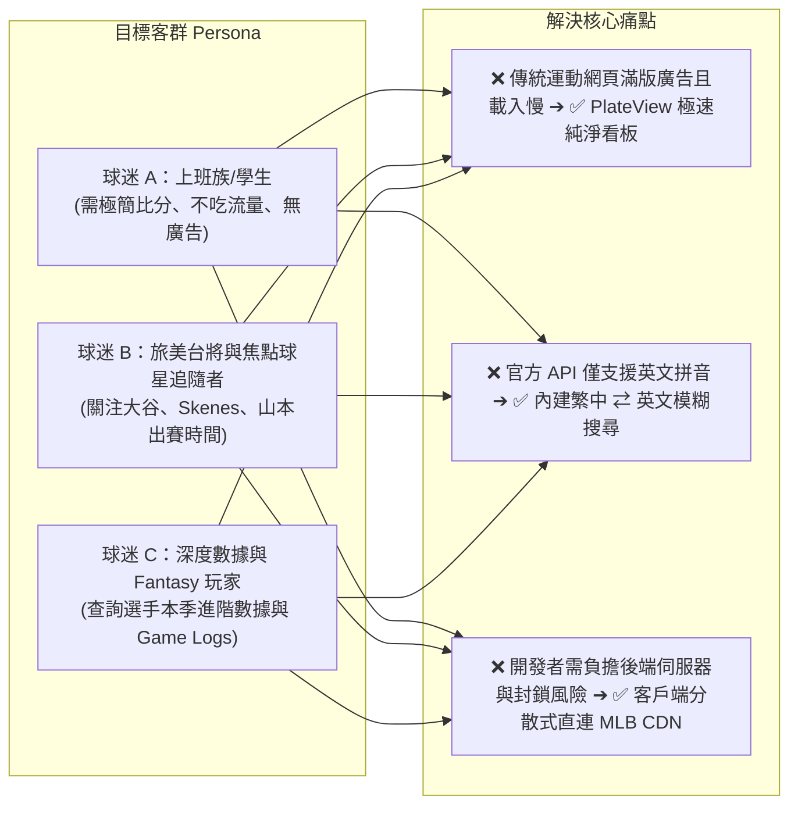
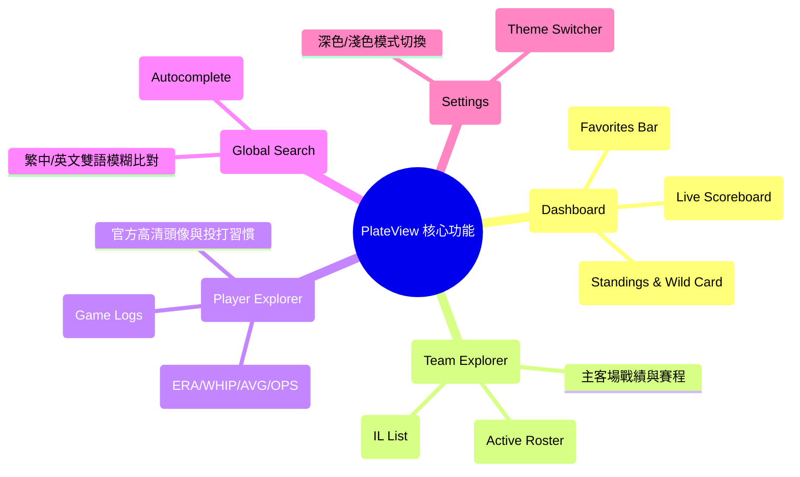
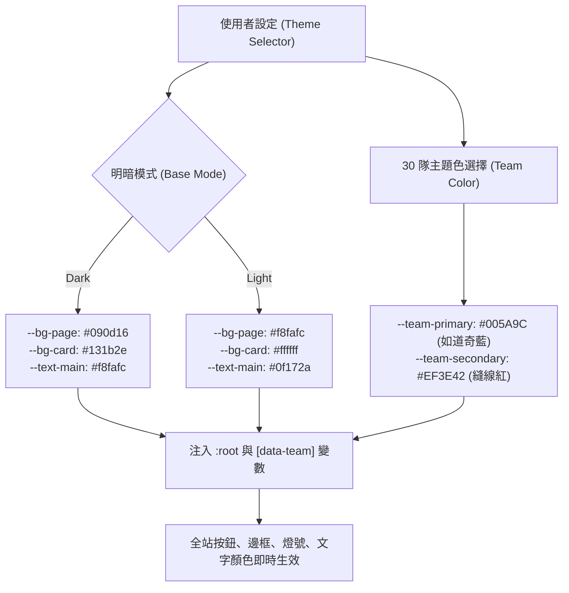

# PlateView（`plateview-mlb`）產品需求文件 (PRD)

**文件版本**：v1.0.0  
**發布日期**：2026-08-27（民國 115 年 8 月 27 日）  
**專案狀態**：設計完備 / 準備開發（Ready for Development）  
**開源授權**：MIT License  
**專案儲存庫（建議）**：`https://github.com/<username>/plateview`  
**生產部署網址（預期）**：`https://<username>.github.io/plateview/`

---

## 1. 專案願景與執行摘要 (Executive Summary)

### 1.1 產品願景（Vision）
**PlateView**（取自 Home Plate 本壘板 ＋ View 視野）是一個專為棒球迷、數據愛好者與台灣球迷打造的**現代化、極簡、零延遲、純開源的 MLB 大聯盟數據查詢與即時比分服務**。

### 1.2 核心價值主張（Core Value Propositions）
1.  **零伺服器、永久零成本（Zero-Cost Serverless）**：完全由 GitHub Pages 託管純靜態單頁應用程式（SPA），每位使用者的瀏覽器直接連線大聯盟官方 CDN（`statsapi.mlb.com`），免後端、免資料庫、免主機維運費用。
2.  **極致輕量與無廣告干擾（Ad-Free Minimalist UI）**：摒除傳統運動網站臃腫廣告與追蹤腳本，打包體積 < 500 KB，秒級即時載入。
3.  **在地化雙語體驗（Bilingual Localization）**：內建台灣球迷慣用之繁體中文譯名對照字典（如搜尋「大谷」、「斯肯斯」、「道奇」即可秒級匹配對應官方數據）。
4.  **沉浸式 30 隊動態主題（30-Team Dynamic Theming）**：支援深色/淺色模式，並可一鍵切換 30 支大聯盟球隊之官方主題色。

---

## 2. 目標受眾與使用者痛點 (Target Audience & Problem Statement)



---

## 3. 系統架構與技術棧 (Technical Architecture & Stack)

```mermaid
flowchart TD
    subgraph 託管與 CI/CD 層 (GitHub)
        Repo["GitHub 開源倉庫<br>(React + Vite + TS)"] -->|"git push main"| Action["GitHub Actions 流水線"]
        Action -->|"一鍵構建與發布"| GHPages["⭐ GitHub Pages CDN<br>(伺服 index.html, JS, CSS)"]
    end

    subgraph 客戶端運行環境 (User Browser)
        Browser["使用者瀏覽器 (Desktop / Mobile)"]
        Browser -->|"載入靜態 SPA"| GHPages
        
        subgraph 前端應用核心模組
            Router["HashRouter 路由 (#/)"]
            ThemeEngine["動態主題引擎 (CSS Variables)"]
            CacheLayer["TanStack Query 快取層"]
            LocalStore["LocalStorage (最愛球隊/球員)"]
        end
    end

    subgraph 大聯盟官方數據雲 (MLB CDN)
        MLB_API["⚾ statsapi.mlb.com/api/v1<br>• Access-Control-Allow-Origin: *<br>• 免 API Key / 官方 Fastly CDN 快取"]
        MLB_IMG["🖼️ img.mlbstatic.com<br>(球員高清頭像 / 官方隊徽 SVG)"]
    end

    CacheLayer <-->|"HTTPS GET 直連查詢"| MLB_API
    Browser <-->|"直連圖片渲染"| MLB_IMG
```

### 3.1 前端技術選型
*   **構建工具與語言**：**Vite 5+ ＋ TypeScript 5+**
*   **前端框架**：**React 18 / 19**
*   **路由管理**：**`react-router-dom`（使用 `HashRouter`）**（*避開 GitHub Pages 子路徑重新整理 404 錯誤*）
*   **樣式與圖標**：**Tailwind CSS 3+ ＋ Lucide React Icons**
*   **非同步數據與快取管理**：**TanStack Query v5（React Query）**（*支援背景輪詢、請求去重與多層快取*）
*   **時間與時區格式化**：**`date-fns` ＋ 瀏覽器原生 `Intl.DateTimeFormat`**（*UTC 自動轉台灣時間*）

---

## 4. 詳細功能規格 (Functional Specifications)



---

### 4.1 模組一：首頁看板（Dashboard - `/`）
1.  **我的最愛置頂列（Favorites Bar）**：
    *   讀取 `LocalStorage` 中已收藏的球隊與球星；
    *   若今天有比賽，優先顯示已收藏球隊的「即時比分迷你卡」；若收藏球星今日先發，顯示「⭐ 今日先發」高亮徽章。
2.  **今日即時比分看板（Live Scoreboard）**：
    *   **日期切換器**：支援「前一天（Yesterday）」、「今日（Today）」、「後一天（Tomorrow）」及日曆選取器；
    *   **單場比分卡片（Scoreboard Card）**：
        *   **比賽狀態**：
            *   `未開賽`：顯示開賽時間（在地時區，如 `07:10 AM`）、雙方預計先發投手及本季戰績/防禦率（`P. Skenes (8-2, 2.15 ERA)`）；
            *   `進行中 (Live)`：顯示當前局數（`🔴 Top 7th`）、即時比分、出局數燈號（●●○）、好壞球（`2-2`）、在壘狀態（一/二/三壘菱形即時亮燈）；
            *   `已結束 (Final)`：顯示最終比分、勝投/敗投/救援投手（`W: Glasnow / L: King / S: Phillips`）；
            *   `延賽 (Postponed)`：標註因雨延賽（PPD）與補賽資訊；
        *   **局數比分板（Linescore 折疊展開）**：點擊卡片可展開 1~9+ 局每局得分明細、安打（H）、失誤（E）。
    *   **自動輪詢機制**：進行中賽事每 30 秒自動 Polling 更新；分頁非活躍時自動暫停。
3.  **分區戰績與外卡爭霸榜（Standings）**：
    *   美聯（AL）/ 國聯（NL）六大分區 Tab 切換（美東/美中/美西/國東/國中/國西）；
    *   外卡排行（Wild Card Tab）：清楚標示前三名晉級線、勝差（GB）、淘汰魔術數字（E#）。

---

### 4.2 模組二：球隊深度查詢介面（Team Explorer - `#/teams/:teamId`）
1.  **球隊 Header 資訊**：
    *   大聯盟官方向量 SVG 隊徽、球隊全名（中英雙語）、所屬聯盟與分區、當前分區排名、主球場名稱；
    *   「⭐ 收藏球隊」快捷按鈕。
2.  **現役陣容名單（Active 26-Man Roster）**：
    *   **投手組（Pitchers）**：先發投手（SP）、後援投手（RP）、終結者（CP），列出背號、投球手（R/L）、本季 W-L、ERA、WHIP、SO；
    *   **野手組（Position Players）**：捕手（C）、內野手（IF）、外野手（OF）、指定打擊（DH），列出背號、打擊手（R/L/S）、AVG、HR、RBI、OPS；
    *   點擊任一球員名稱即可直接跳轉該球員數據頁。
3.  **傷兵名單專區（Injured List, IL）**：
    *   列出當前處於 10-Day、15-Day、60-Day IL 的球員與預計回歸狀態。

---

### 4.3 模組三：球員深度查詢介面（Player Explorer - `#/players/:personId`）
1.  **球員個人名片**：
    *   大聯盟官方高清大頭照（自動 fallback 至預設剪影圖）；
    *   繁體中文譯名 ＋ 英文原名、所屬球隊、背號、守備位置、年齡、身高體重、投打習慣；
    *   「⭐ 收藏球星」快捷按鈕。
2.  **賽季核心數據面板（Season Stats）**：
    *   **投手模式**：出賽場次（G）、先發場次（GS）、勝敗（W-L）、防禦率（ERA）、局數（IP）、奪三振（SO）、每局被上壘率（WHIP）、被打擊率（BAA）；
    *   **打者模式**：出賽場次（G）、打數（AB）、安打（H）、全壘打（HR）、打點（RBI）、打擊率（AVG）、上壘率（OBP）、長打率（SLG）、OPS、盜壘（SB）。
3.  **近 10 場逐場出賽紀錄（Game Logs）**：
    *   清晰的表格展示最近 10 場出賽的對手、局數/打數、得失分、三振/保送等實戰表現。

---

### 4.4 模組四：全域繁中/英文模糊搜尋（Global Search Modal）
*   **呼叫方式**：點擊頂部搜尋列或按下快捷鍵（`Ctrl + K` / `Cmd + K`）；
*   **搜尋支援**：
    *   **繁體中文球星**：輸入「大谷」、「翔平」、「斯肯斯」、「山本」、「張育成」、「鄭宗哲」；
    *   **英文姓名**：輸入「Ohtani」、「Skenes」、「Judge」、「Soto」；
    *   **球隊名稱**：輸入「道奇」、「洋基」、「海盜」、「Dodgers」、「Yankees」；
*   **即時補全（Autocomplete）**：下拉清單顯示頭像/隊徽、球隊與守備位置，點擊即秒級跳轉。

---

## 5. UI/UX 視覺與動態主題規範 (Visual & Theming Spec)



### 5.1 色系規格定義
*   **明亮模式（Light Mode）**：
    *   背景色：`#f8fafc`（Slate-50）
    *   卡片底色：`#ffffff`（純白）
    *   主文字：`#0f172a`（Slate-900）
    *   邊框：`#e2e8f0`（Slate-200）
*   **黑暗模式（Dark Mode - 預設）**：
    *   背景色：`#090d16`（極致深邃黑）
    *   卡片底色：`#131b2e`（深石板藍灰）
    *   主文字：`#f8fafc`（冰川亮白）
    *   邊框：`#1e293b`（Slate-800）
*   **30 隊動態主題色（`--team-primary`）**：
    *   預設經典藍：`#005A9C`
    *   洛杉磯道奇：`#005A9C`（道奇藍）
    *   紐約洋基：`#003087`（海軍藍）
    *   聖地牙哥教士：`#FFC425`（教士金）
    *   匹茲堡海盜：`#FDB827`（海盜金）
    *   波士頓紅襪：`#BD3039`（紅襪紅）
    *   舊金山巨人：`#FD5A1E`（巨人橘）
    *   *(其餘球隊依官方 Hex 色碼完整映射)*

---

## 6. MLB Stats API 端點規格與調用清單 (API Mapping)

所有端點 Base URL 均為：`https://statsapi.mlb.com/api/v1`

| 功能分類 | 請求方法與路徑 | 關鍵 Query 參數 | 快取策略 (Stale Time) |
|---|---|---|---|
| **今日賽況與比分** | `GET /schedule` | `sportId=1`<br>`date=YYYY-MM-DD`<br>`hydrate=linescore,team,probablePitcher(note)` | 30 秒（進行中）/ 5 分鐘（未開賽） |
| **先發投手區間查詢** | `GET /schedule` | `sportId=1`<br>`startDate=YYYY-MM-DD`<br>`endDate=YYYY-MM-DD`<br>`hydrate=probablePitcher` | 10 分鐘 |
| **球員姓名搜尋** | `GET /people/search` | `names={keyword}`<br>`sportId=1` | 1 小時 |
| **球員個人數據** | `GET /people/{personId}` | `hydrate=currentTeam,stats(group=[hitting,pitching],type=[season,gameLog])` | 10 分鐘 |
| **聯盟分區戰績** | `GET /standings` | `leagueId=103,104`<br>`season=2026`<br>`hydrate=division,conference` | 15 分鐘 |
| **球隊陣容名單** | `GET /teams/{teamId}/roster` | `rosterType=active`<br>`hydrate=person` | 1 小時 |
| **球員高清大頭照** | `GET (Image)` | `https://img.mlbstatic.com/mlb-photos/image/upload/w_213,q_auto:best/v1/people/{id}/headshot/67/current` | 瀏覽器永久快取 |
| **球隊官方 SVG 隊徽** | `GET (Image)` | `https://www.mlbstatic.com/team-logos/{teamId}.svg` | 瀏覽器永久快取 |

---

## 7. 專案目錄結構 (Project Directory Layout)

```
plateview/
├── .github/
│   └── workflows/
│       └── deploy.yml              # GitHub Actions 自動化構建發布流水線
├── public/
│   ├── favicon.svg                 # PlateView 專屬本壘板 Icon
│   └── 404.html                    # SPA HashRouter 404 防呆重定向腳本
├── src/
│   ├── assets/                     # 靜態資源與預設占位圖
│   ├── components/
│   │   ├── common/
│   │   │   ├── Navbar.tsx          # 頂部導航 (含全域搜尋、主題切換器)
│   │   │   ├── SearchModal.tsx     # 繁中雙語模糊搜尋彈窗
│   │   │   ├── ThemeSelector.tsx   # 30 隊主題與明暗模式下拉切換
│   │   │   └── Footer.tsx          # 官方免責聲明 (Disclaimer)
│   │   ├── scoreboard/
│   │   │   ├── ScoreboardGrid.tsx  # 比分卡片網格容器
│   │   │   ├── ScoreboardCard.tsx  # 單場賽事卡片 (即時比分/在壘動態)
│   │   │   └── LinescoreModal.tsx  # 局數比分明細
│   │   ├── standings/
│   │   │   └── StandingsTable.tsx  # 分區戰績與外卡榜
│   │   ├── team/
│   │   │   ├── TeamHeader.tsx      # 球隊隊徽與戰績摘要
│   │   │   └── RosterList.tsx      # 26 人現役名單與傷兵名單
│   │   ├── player/
│   │   │   ├── PlayerHeader.tsx    # 球員頭像與基本檔案
│   │   │   ├── StatsCard.tsx       # 賽季核心數據面板
│   │   │   └── GameLogsTable.tsx   # 近 10 場逐場比賽紀錄
│   │   └── favorite/
│   │       └── FavoritesBar.tsx    # 首頁頂部釘選追蹤列
│   ├── pages/
│   │   ├── HomePage.tsx            # 首頁 (比分看板 + 分區戰績)
│   │   ├── TeamDetailPage.tsx      # 球隊深度查詢頁
│   │   └── PlayerDetailPage.tsx    # 球員深度查詢頁
│   ├── services/
│   │   ├── mlbApi.ts               # 原生 Fetch 封裝 (直連 statsapi.mlb.com)
│   │   └── queries.ts              # TanStack Query 專屬 Hooks
│   ├── data/
│   │   ├── teams.json              # 30 支球隊基本檔 (中英文、主色碼、分區)
│   │   └── players-zh-tw.json      # 常用焦點球星繁中譯名對照字典
│   ├── hooks/
│   │   ├── useFavorites.ts         # LocalStorage 收藏管理 Hook
│   │   └── useTheme.ts             # 30 隊主題與明暗切換 Hook
│   ├── utils/
│   │   ├── timezone.ts             # UTC 轉本地時區格式化工具
│   │   └── statsFormatters.ts      # 棒球數據格式化 (ERA, AVG, OPS)
│   ├── types/
│   │   └── mlb.d.ts                # TypeScript 介面定義 (Game, Player, Team)
│   ├── App.tsx                     # 路由進入點 (HashRouter 避坑配置)
│   ├── main.tsx                    # React 根節點
│   └── index.css                   # Tailwind CSS ＋ CSS Variables 主題注入
├── index.html
├── package.json
├── tailwind.config.js
├── tsconfig.json
└── vite.config.ts                  # base: './' 相對路徑設定
```

---

## 8. 法律合規性與開源免責宣告 (Legal Compliance & Disclaimer)

本專案採 **MIT License** 開源發布，且嚴格遵守非商業研究用途。網站頁腳（Footer）與 GitHub README 必須包含以下官方免責宣告：

### 8.1 繁體中文免責宣告
> *「本專案（PlateView）為開源非商業之棒球數據查詢工具，僅供個人學習、數據研究與球迷交流使用。本網站所引用之所有賽事比分、數據、球員肖像與球隊商標版權，均歸 Major League Baseball (MLB) 及其相關所屬實體所有。本專案與 Major League Baseball 無任何官方隸屬、授權或背書關係。」*

### 8.2 英文免責宣告 (English Disclaimer)
> *"PlateView is an open-source, non-commercial baseball statistics explorer designed for personal research and educational purposes. All MLB trademarks, logos, team names, player photos, and statistical data are the intellectual property of Major League Baseball and its clubs. This project is not affiliated with, endorsed by, or sponsored by Major League Baseball."*

---

## 9. 部署與發布規範 (Deployment Specification)

### 9.1 GitHub Actions CI/CD 配置（`.github/workflows/deploy.yml`）
```yaml
name: Deploy PlateView to GitHub Pages

on:
  push:
    branches: [ main ]
  workflow_dispatch:

permissions:
  contents: read
  pages: write
  id-token: write

concurrency:
  group: "pages"
  cancel-in-progress: false

jobs:
  build:
    runs-on: ubuntu-latest
    steps:
      - name: Checkout repository
        uses: actions/checkout@v4

      - name: Setup Node.js
        uses: actions/setup-node@v4
        with:
          node-version: 20
          cache: 'npm'

      - name: Install dependencies
        run: npm ci

      - name: Build static site
        run: npm run build

      - name: Upload artifact
        uses: actions/upload-pages-artifact@v3
        with:
          path: ./dist

  deploy:
    environment:
      name: github-pages
      url: ${{ steps.deployment.outputs.page_url }}
    runs-on: ubuntu-latest
    needs: build
    steps:
      - name: Deploy to GitHub Pages
        id: deployment
        uses: actions/deploy-pages@v4
```

---

## 10. 開發里程碑 (Milestones & Roadmap)

| 階段 (Phase) | 預計工作項目 | 交付產出 |
|---|---|---|
| **Phase 1: 專案基建與骨架** | • 初始化 Vite + React + TS 專案<br>• 配置 Tailwind CSS、動態主題變數與 30 隊色碼<br>• 設定 HashRouter 路由與 GitHub Actions CI/CD 流水線 | 可成功部署至 GitHub Pages 的基礎空架構 |
| **Phase 2: 首頁比分與戰績** | • 封裝 `mlbApi.ts`（`/schedule`、`/standings`）<br>• 實作首頁即時比分卡片（Linescore、在壘動態、局數）<br>• 實作分區戰績與外卡榜 Tabs 切換<br>• 加入 30 秒自動輪詢與時區自動轉換 | 具備實時看球功能的完整首頁 |
| **Phase 3: 深度查詢與搜尋** | • 實作 `#/teams/:teamId` 球隊名單與傷兵頁面<br>• 實作 `#/players/:personId` 球員賽季數據與近 10 場 Game Logs<br>• 建構 `players-zh-tw.json` 繁中譯名對照字典<br>• 實作 `SearchModal` 全域模糊搜尋彈窗 | 支援球星/球隊深度探索與雙語搜尋 |
| **Phase 4: 個人化與細節打磨** | • 實作 `useFavorites`（LocalStorage 最愛球隊/球星置頂）<br>• 實作 30 隊主題切換器（Theme Switcher）與深淺模式<br>• 完善異常狀態（PPD 延賽、雙重賽、TBD 投手）防呆 UI<br>• 部署上線並完成開源 README 與免責宣告 | 100% 完整交付之 PlateView 正式版 |
